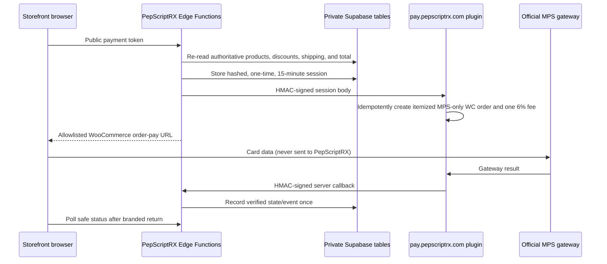

# PepScriptRX WooCommerce Payment Bridge

Status: deployed to PepScriptRX Staging (`yjexrleubnjuitiyjvoy`) with both
feature flags disabled; not installed on WordPress; production untouched.

## Architecture and trust boundaries



The browser supplies only the existing unguessable public payment token. The
initiation function reloads the order, amount, currency, store, canonical line
items and variations, quantities, discounts, shipping, customer destination,
and attribution from `patient_submissions`. WooCommerce receives itemized
customer-safe order data. It does not become the catalog, pricing, attribution,
commission, or inventory source of truth.

The signed fee contract is `woocommerce_6_percent_v1`: WooCommerce creates
exactly one `Processing Fee` equal to 600 basis points of the signed pre-fee
amount, rounded half-up to integer cents. The pre-fee amount is merchandise
after discounts plus shipping plus authoritative tax, and the captured total is
pre-fee amount plus that one fee. PepScriptRX does not add the fee to its
products, shipping, commissions, wallets, or original order total. The callback
must report exactly one matching fee, total, and cart fingerprint before the
shared finalizer can run. There is currently no authoritative tax column in
`patient_submissions`; the bridge therefore binds tax to zero and fails closed
instead of estimating a tax. A taxable pilot requires an authoritative tax
source to be added and validated first.

Approved Stripe, PayPal, and WooCommerce payments call
`finalize_verified_paid_order`. The database function locks the PepScriptRX
order, validates exact USD amount, records a unique provider event, transitions
the order, applies the existing commission and wallet formulas, and inserts an
idempotent notification outbox record in one transaction. WooCommerce is marked
paid only after this result is `finalized` or a fact-matching
`already_finalized`.

Initial-launch policy intentionally leaves inventory and promo behavior
unchanged: no payment provider mutates inventory in the finalizer, and promo
usage is not incremented again. Refunds, partial refunds, voids, disputes, and
chargebacks create private, idempotent manual-reconciliation records without
automatic financial reversal.

## Application environment

Server-only Supabase Edge Function secrets (values intentionally omitted):

- `WOOCOMMERCE_BRIDGE_ENABLED`
- `WOOCOMMERCE_BRIDGE_URL`
- `WOOCOMMERCE_BRIDGE_SECRET`
- `WOOCOMMERCE_BRIDGE_KEY_ID`
- `WOOCOMMERCE_CALLBACK_SECRET`
- `WOOCOMMERCE_CALLBACK_URL`
- `WOOCOMMERCE_ALLOWED_ORIGINS`
- `WOOCOMMERCE_ALLOWED_STORE_SCOPES`
- `APP_URL` (or the existing `SITE_URL`)

Public Vercel build setting:

- `VITE_WOOCOMMERCE_BRIDGE_VISIBLE=false`
- `VITE_WOOCOMMERCE_ALLOWED_STORE_SCOPES` (one exact staging scope for the pilot)

Validated staging frontend origin:

```text
https://pepscriptrx-git-agen-c9d866-manuel-rodriguezs-projects-f5946c44.vercel.app
```

Keep both flags false until non-production database validation passes and
controlled testing is authorized. Request and callback secrets must be different random
values. Generate them locally with a cryptographic password manager or
`openssl rand -hex 32`; enter them directly in Supabase and WordPress. Never
paste them into tickets, chat, logs, or repository files.

## WordPress installation

1. Verify the ZIP checksum against the validation report.
2. In WordPress Admin, open Plugins > Add New > Upload Plugin and select
   `artifacts/pepscriptrx-payment-bridge.zip`.
3. Install and activate **PepScriptRX Payment Bridge**. Do not change or replace
   the official MPS plugin.
4. Open WooCommerce > PepScriptRX Bridge.
5. Enter the key ID, distinct request/callback secrets, verified MPS
   WooCommerce gateway ID, and the non-production Supabase callback hostname.
   Obtain the gateway ID from the installed plugin configuration without
   viewing, copying, or changing MPS credentials. Secret inputs are write-only.
6. Leave **Enabled** unchecked and save.
7. Confirm `/wp-json/pepscriptrx-bridge/v1/health` returns `"ok":true` and
   `"configured":false`. A false configured value is required while disabled.
8. Confirm the PepScriptRX frontend build setting remains
   `VITE_WOOCOMMERCE_BRIDGE_VISIBLE=false`.
9. Do not run a charge until the database launch gates and a separate payment
   authorization pass.

The plugin does not read or change MPS credentials. It disables catalog-style
checkout entry, limits a bridge order to the configured MPS gateway, marks
checkout pages `noindex`, validates signed timestamps/nonces, and allowlists
PepScriptRX return hosts.

## Test and controlled rollout

1. Apply the additive bridge, shared-finalizer, and structured-fee migrations in
   a designated non-production Supabase project.
2. Deploy the three Edge Functions with bridge flags disabled.
3. Install/configure the plugin on a non-public or access-controlled WordPress
   environment.
4. Use mocked WooCommerce status changes; confirm modified signatures, amounts,
   expired/reused tokens, unknown key IDs, and replayed events are rejected.
5. Confirm the installed WooCommerce order reaches `processing` or `completed`,
   `is_paid()` is true, and the signed callback finalizes exactly once.
6. Enable the server flag for one internal storefront, then UI visibility.
7. A live charge requires separate explicit approval. If MPS has no sandbox, do not
   represent mocks as processor testing.

## Disabled-state non-production deployment commands

These commands are prepared only. Replace placeholders locally; do not paste
secret values into a shell history, ticket, or source file. First create or
designate a Supabase project whose name explicitly includes `Staging`, `Test`,
or `Nonprod`, then verify its reference in the Dashboard.

```powershell
supabase link --project-ref <NONPRODUCTION_PROJECT_REF>
supabase projects list
supabase db push --dry-run
supabase db push
supabase secrets set WOOCOMMERCE_BRIDGE_ENABLED=false
supabase functions deploy create-woocommerce-payment-session
supabase functions deploy woocommerce-payment-status
supabase functions deploy woocommerce-payment-callback --no-verify-jwt
```

`supabase db push --dry-run` must show
`20260730230000_woocommerce_payment_bridge.sql` and
`20260731010000_shared_paid_order_finalizer.sql`, followed by
`20260801010000_woocommerce_structured_fee_contract.sql`, and must not target
the production project. If it shows other pending migrations, review and
validate the complete ordered set in non-production before running `db push`.

The frontend remains disabled independently:

```text
VITE_WOOCOMMERCE_BRIDGE_VISIBLE=false
```

If no non-production project exists, the shortest safe setup is: Supabase
Dashboard > New project > name it `PepScriptRX Staging` > choose an organization
and region > set a unique new database password > create the empty project.
Do not clone production secrets or customer data. Then use its project reference
in the commands above.

## Reconciliation and refund operations

Query private sessions and `payment_reconciliation_events` where status is
`open`. Compare the
WooCommerce order, amount, currency, gateway transaction reference, callback
time, and PepScriptRX order state. Customer redirects are never proof of
payment. Refund, partial-refund, void, and dispute callbacks remain
reconciliation items until the existing commission and fulfillment reversal
rules are centralized. If MPS exposes no chargeback hook, review the merchant
portal daily and record a sanitized manual reconciliation event.

## Emergency disable and rollback

1. Set `WOOCOMMERCE_BRIDGE_ENABLED=false`.
2. Set `VITE_WOOCOMMERCE_BRIDGE_VISIBLE=false` and redeploy the frontend.
3. Disable the WordPress plugin if needed.
4. Keep Stripe enabled and leave bridge session records intact for audit.
5. Do not drop the migration table during an incident. The additive migration
   can remain dormant; remove it only after the record-retention period.

## Compliance boundary

Card data is intended to remain exclusively on the WooCommerce/MPS hosted
checkout. This design reduces PepScriptRX exposure but is not a PCI, legal,
state-fee, debit-card, or card-brand compliance determination. Confirm the
hosted fields, scripts, logs, receipts, 6% fee disclosure and permissibility,
and applicable SAQ scope with MPS and qualified compliance professionals.
